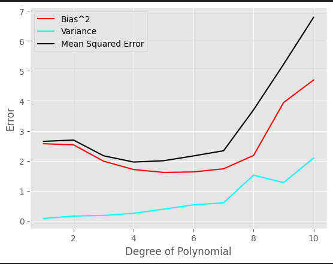
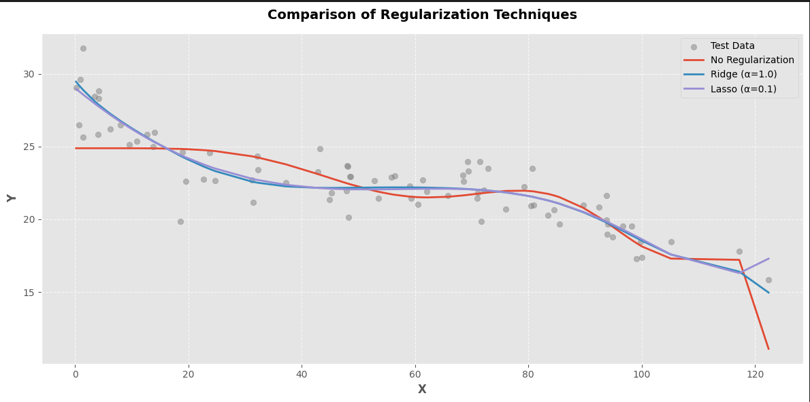
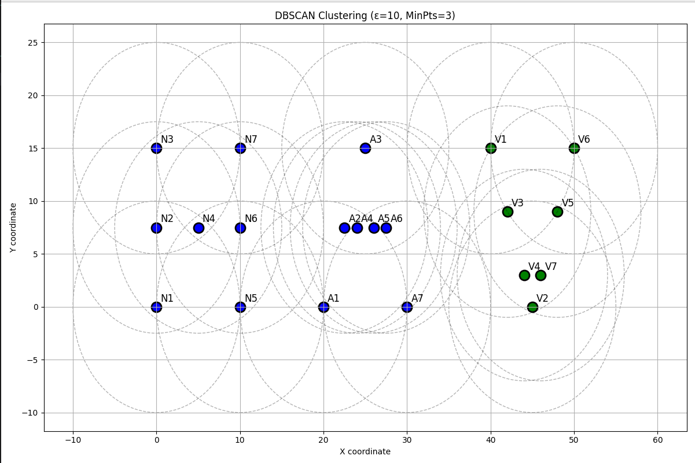
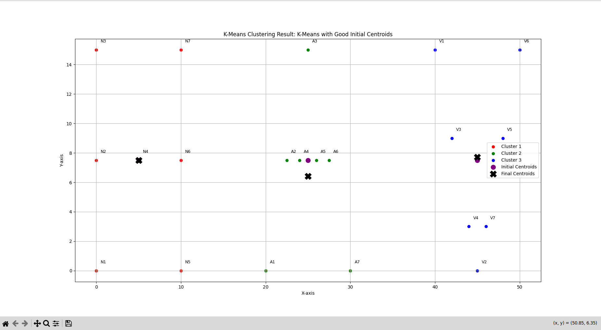
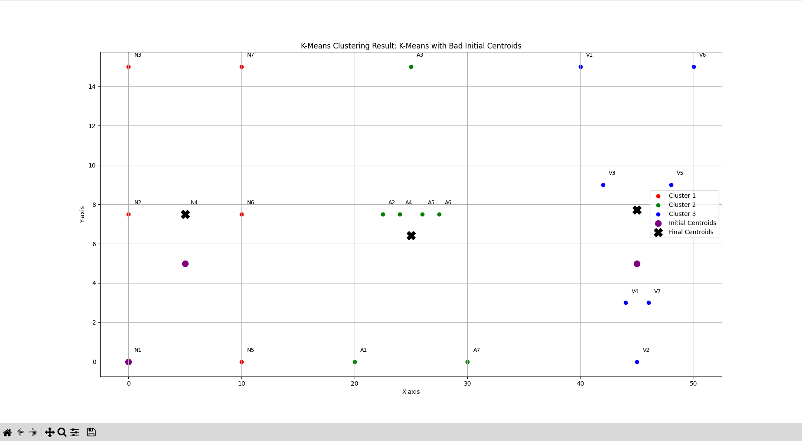

# ML Analysis: Bias-Variance, Clustering & Association Mining

This project combines foundational machine learning tasks including regression analysis, unsupervised clustering, and association rule mining — built from scratch and visualized using Python.

## 📌 Highlights

- 📉 Polynomial regression (degree 1–10) on synthetic data
- 📊 Bias², variance, and MSE trade-off plots
- 🔐 Regularization with Ridge & Lasso (Sklearn)
- 📍 K-Means & DBSCAN clustering on custom 2D letter data ('N', 'A', 'V')
- 🛒 Apriori algorithm implemented from scratch to mine frequent itemsets

## 📁 Structure

- `assignment_1_bias_variance/`: Polynomial regression + bias-variance trade-off analysis
- `assignment_2_clustering_apriori/`: K-Means, DBSCAN, and Apriori implementation
- `data/`: Contains example transaction and point data (if applicable)
- `results/`: Graphs and tables used for final analysis

## 📊 Sample Visuals

## 🔧 Tech Stack

- Python, NumPy, Pandas, Scikit-learn, Matplotlib
- Jupyter Notebooks
- Custom implementations (Apriori)

## 🧠 Learnings

- Understanding model complexity via bias-variance decomposition
- Evaluating clustering algorithms for shape sensitivity and density
- Rule mining using classic data mining approaches

---

> Created as part of coursework at IIIT-Hyderabad, Spring 2025.
